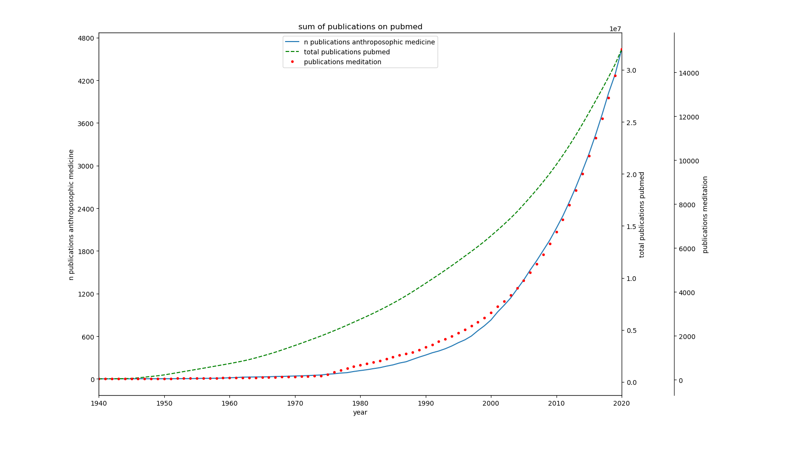
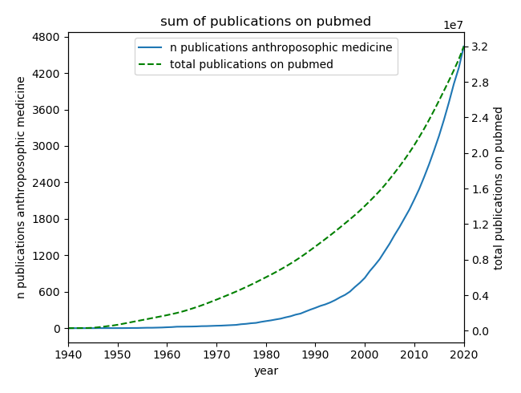

pubmed_anthroplot
=================

Python scripts to create a plot of publications on pubmed a) in relation to anthroposophic medicine and b) in relation to publications about meditation compared to the overall publications on pubmed

* pubmed_stat.py fetches data from pubmed and writes csv outfiles
* plot_statistics.py creates graphs from previously written csv

First run ```pubmed_stat.py```. It will create data files in the datadir (default: ```../data```).

After that run ```plot_statistics.py```. It will create an image file in the imagedir (default: ```../img```).

Both scripts need a config file. Default ist ```pubmed_anthroplot.json```. This defines the search term and label of plot and axes.

3 plots
=======



2 plots
=======


Credits
=======
Original publication "Klinische Forschung zur Anthroposophischen Medizin Update eines «Health Technology Assessment»-Berichts und Status Quo" https://docplayer.org/62953772-Klinische-forschung-zur-anthroposophischen-medizin-update-eines-health-technology-assessment-berichts-und-status-quo.html
