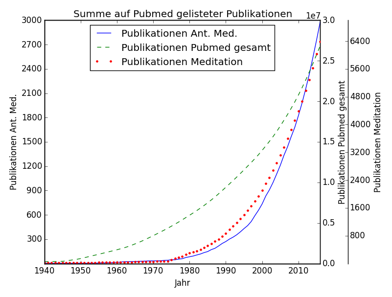

pubmed_anthroplot
=================

Python skript to create a plot of publications on pubmed a) in relation to anthroposophic medicine and b) in relation to publications about meditation 

* pubmed_stat.py fetches data from pubmed and writes csv outfiles
* plot_statistics.py creates graphs from previously written csv

First run pubmed_stat.py. It will create data files in the datadir (default: ../data).
After that run plot_statistics.py. It will create an image file in the imagedir (default: ../img).

